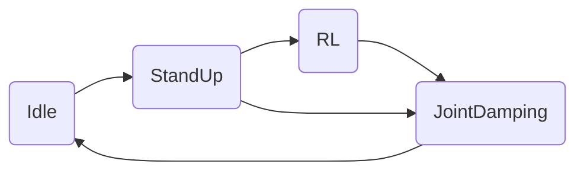
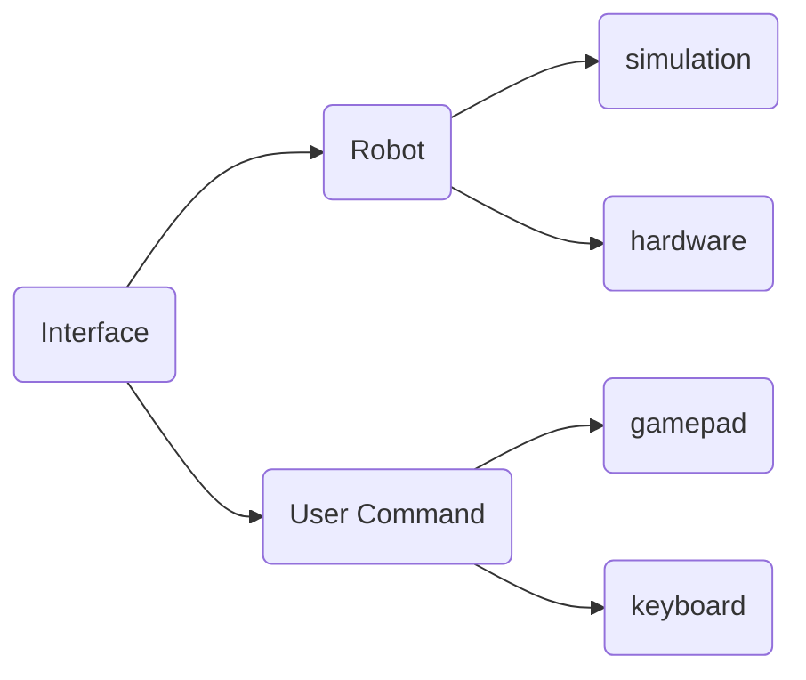
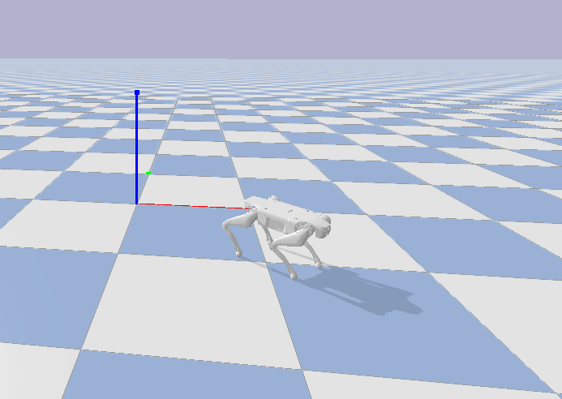

# RL_DEPLOY

[English](./README_EN.md)

## 下载编译

```bash
git clone --recurse-submodules https://github.com/DeepRoboticsLab/Lite3_rl_deploy.git
mkdir build && cd build
cmake .. -DBUILD_PLATFORM=x86 -DBUILD_SIM=off -DSEND_REMOTE=OFF 
make -j4
```

## 模型转换

运行RL训练出的策略文件需要链接onnxruntime库，而onnxruntime支持的模型为.onnx格式，需要手动转换.pt模型为.onnx格式。

可以通过运行policy文件夹中的pt2onnx.py文件将.pt模型转化为.onnx模型。注意观察程序输出对两个模型一致性的比较。

首先配置和验证程序运行环境

```bash
pip install torch numpy onnx onnxruntime

python3 -c 'import torch, numpy, onnx, onnxruntime; print(" All modules OK")'

```

然后运行程序

```bash
cd your/path/to/LITE3_RL_DEPOLY/policy/

python pt2onnx.py
```
就可以在当前文件夹看到对应的.onnx模型文件了


### 注意事项：

1.Lite3上的运动主板是arm架构，如果编译在狗上运行需要安装交叉编译工具

```bash
sudo apt-get install gcc-aarch64-linux-gnu g++-aarch64-linux-gnu
```

2.目前示例给出的远程遥控是按照手柄输入来的，建议提前根据[gamepad](https://github.com/DeepRoboticsLab/gamepad.git) 中的介绍提前测试一下手柄的通讯是否正常。

3.示例程序中给出了基于pybullet平台的仿真验证程序，有兴趣的同学可以前往https://pybullet.org/wordpress/ 了解细节。

4. 项目默认使用ONNX，如果需要使用libtorch，需要手动调整CMakeList设置。


## 各模块介绍

### state_machine




state_machine模块是Lite3在不同的状态之间来回切换，不同的状态代表的功能如下：

1.Idle 空闲状态，表示机器狗处于关节不发力的情况

2.StandUp 站起状态，表示机器狗从趴下到站起的动作

3.RL RL控制状态，表示机器狗执行策略输出的action

4.JointDamping 关节阻尼状态，表示机器狗的关节处于阻尼控制状态

### interface



interface模块表示机器狗的数据接受和下发接口和手柄控制的输入。其中机器狗平台的输入分为仿真和实物，手柄的输入分为键盘和手柄控制。

### run_policy


这部分用于执行RL策略的输出，新的策略可以通过继承policy_runner_base实现。


## 实机部署步骤

### 1.本地电脑交叉编译部署

1.准备Ubuntu系统的电脑，且系统为18.04或20.04，如果没有需要将程序scp到运动主机上编译运行。

2.在电脑上安装expect脚本解释器 

```shell
sudo apt-get install expect
```

3.连上狗的wifi 

4.在本机执行rl_deploy/scripts目录下的scp_torch_to_remote.sh脚本，注意修改脚本中定义的ip和用户名 

5.ssh [ysc@192.168.1.120](mailto:ysc@192.168.1.120)连进狗的运动主机。修改Lite3运动主机中的`~/jy_exe/conf/network.toml`，将ip项修改为运动主机本地的ip[127.0.0.1](http://127.0.0.1)或者其他本地ip，然后重新执行`sudo ~/jy_exe/restart.sh`脚本重启运动程序。 

6.进入本地的`rl_deploy`文件夹，执行编译执行流程。

```shell
 mkdir build 
 cd build 
 cmake .. -DBUILD_PLATFORM=arm -DBUILD_SIM=off -DSEND_REMOTE=ON 
 make -j4 
```

7.直接执行`./rl_deploy`。观察程序能否正常运行，解决具体问题。实现键盘控制或者手柄控制。


### 2.Lite3运动主机部署

1.将`rl_deploy`文件夹直接拖入或者scp到运动主机的根目录下 

2.连上狗的wifi 

3.ssh [ysc@192.168.1.120](mailto:ysc@192.168.1.120)连进狗的运动主机。修改`~/jy_exe/conf/network.toml`将ip项修改为运动主机的本地ip[127.0.0.1](http://127.0.0.1)，然后重新执行`sudo ~/jy_exe/restart.sh`脚本重启运动程序。 

4.远程连接狗，进入rl_deploy文件夹，执行编译执行流程。 

```shell
mkdir build 
cd build 
cmake .. -DBUILD_PLATFORM=arm -DBUILD_SIM=off -DSEND_REMOTE=OFF 
make -j4 
```

5.直接执行`./rl_deploy`。观察程序能否正常运行，解决具体问题。实现键盘操控或者手柄配置


### 3.本地直接运行

1.利用“金手指”与Lite3有线连接，能够通过本机ping通运动主机192.168.1.120。

2.ssh [ysc@192.168.1.120](mailto:ysc@192.168.1.120)连进狗的运动主机。修改`~/jy_exe/conf/network.toml`将ip项修改为本机ip(192.168.1.xxx)，然后重新执行 `sudo ~/jy_exe/restart.sh`脚本重启运动程序。

3.本地编译通过。

4.直接执行`./rl_deploy`


## 仿真验证

程序还可以用其他仿真平台验证运动程序是否能正常运行，可以用pybullet(Raisim)和Mujoco验证。

## pybullet实现仿真验证
pybullet仿真与C++运动程序是通过UDP实现实时通讯。为实现仿真验证，需要安装相应的python以及仿真环境。

1.确保本机安装python和pybullet(通过pip install pybullet安装即可)，确保pybullet可以正常import和打开。

2.执行命令，打开仿真环境，这里需要对`third_party/URDF_model/lite3_urdf/`目录下的压缩文件进行解压。

```bash
cd interface/robot/simulation
python pybullet_simulation.py
```

3.编译程序，需要考虑仿真的编译选项

```bash
mkdir build 
cd build 
cmake .. -DBUILD_PLATFORM=x86 -DBUILD_SIM=ON -DSEND_REMOTE=OFF 
make -j4 
```

4.执行编译出的可执行文件，在pybullet环境中实现对机器人的控制。后续的开发可以在仿真环境中先验证。




## 在mujoco实现仿真验证

本项目支持mujoco进行sim2sim的验证，同时支持纯c++和调用python接口两种形式

### python接口方式
通过python程序单独开启一个仿真器的进程，与控制器通过UDP进行数据传输。
**此模式下c++控制器端仍采用pybullet interface的c++接口（ri_ptr_ = std::make_shared<PybulletInterface>("Lite3");)，后续进一步开发可以单独新建mujoco的cpp接口完成通信
此时编译并运行控制器
```bash
mkdir build 
cd build 
cmake .. -DBUILD_PLATFORM=x86 -DBUILD_SIM=ON -DSEND_REMOTE=OFF 
make -j4 
./rl_deploy
```
然后运行仿真器
```bash
cd interface/robot/simulation
python3 mujoco_simulation.py
```

### cpp接口方式
纯c++实现，避免了python的引入可能造成的版本问题，并且不通过UDP通信而直接在内存层面实现数据传输。
但由于mujoco的cpp接口不支持直接完成渲染，所以使用OpenGL单独完成渲染

(1) 环境配置
在mujoco官方网站下载mujoco release的.tgz文件，解压在third_party中
https://github.com/google-deepmind/mujoco/releases/tag/2.3.7

为了支持mujoco的可视化，安装GLFW
```bash
sudo apt update
sudo apt install libglfw3-dev
```

（***）在arm中实现mujoco仿真

CMAKELIST中设置一下SENDREMOTE相关配置

（2）编译运行

```bash
cmake .. -DBUILD_PLATFORM=x86 -DBUILD_SIM=ON -DUSE_MJCPP=ON
make -j4
./rl_deploy
```


